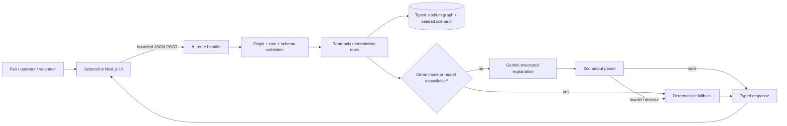

# VenueIQ architecture

VenueIQ is a server-rendered Next.js application with three role-specific clients over one trusted, deterministic stadium model. The model explains and translates trusted facts; it never calculates safety data.

## System context

- **Fans** request accessible navigation, facilities, transport help, and multilingual explanations.
- **Operators** select a seeded incident scenario and review decision-support recommendations.
- **Volunteers** retrieve role-bounded venue SOP guidance and translated checklists.
- **Next.js** renders the experience, validates requests, applies rate limits, and invokes deterministic tools.
- **Gemini** returns schema-constrained summaries and translations only when configured.
- **Upstash Redis** is optional locally and required for fail-closed distributed production rate limiting.

## Client and server boundaries

Browser code receives typed route, scenario, facility, and guidance results. It never imports the Gemini SDK, server environment parser, server prompts, Redis client, or API credentials. Precise location choices remain in the active browser session; preferences use local storage only.

Server route handlers enforce JSON content type, bounded body size, strict Zod schemas, production origin checks, prompt-injection screening, and rate limits before invoking the service. Server errors are mapped to stable public codes with no stack or credential data.

## Data flow

## AI request and tool flow

1. The handler validates transport metadata and a strict request body.
2. The service rejects requests for prompts, credentials, or hidden configuration.
3. A read-only deterministic function computes the route, facilities, current scenario, SOP, or sustainability snapshot.
4. Only the minimum trusted result and user wording are placed into the model prompt.
5. Gemini is called with low temperature, a token cap, a timeout, and one controlled retry.
6. JSON is parsed through an explicit Zod schema. Arbitrary model HTML is never rendered.
7. Any missing key, demo-mode setting, timeout, rate limit, remote error, or invalid response produces a usable deterministic fallback.

## Deterministic routing

The stadium is a typed weighted graph. Routing uses Dijkstra's algorithm. Edges are filtered for closures and accessible-path obstructions, then weighted for distance, crowd density, quietness, and step-free requirements. Walking time is derived from trusted edge distance and a documented accessible walking speed. Map rendering and the ordered text alternative consume the same `RouteResult`.

## Simulation flow

Every simulator selection maps to a fixed seed and immutable scenario definition. Pure functions derive occupancy, density, gate throughput, queue time, risk, incidents, transport, and sustainability values. Changing scenarios is local and deliberate; there is no noisy background polling. The selected snapshot is sent to the operations briefing endpoint for explanation only.

## Trust boundaries

- Untrusted: browser text, headers, storage, request bodies, model output.
- Trusted after validation: local venue graph, SOP content, scenario fixtures, deterministic function results.
- Server secret boundary: Gemini and Upstash credentials are read only by `*.server.ts` modules.
- Human boundary: every operational action is decision support and always requires explicit venue-personnel approval.

## Failure behavior

Failures are intentionally boring and safe. The interface preserves the last deterministic facts, labels the response as fallback, offers retry where appropriate, and provides emergency escalation wording. It does not guess a route through a blocked edge or invent an emergency procedure.

## Major decisions

- Static typed data instead of a database keeps the demonstration reproducible and minimizes personal-data risk.
- A custom SVG map avoids a heavy mapping runtime and always has an equivalent ordered list.
- Server Components are the default; only role workspaces and preference controls are client components.
- Seeded scenarios replace polling and make test expectations stable.
- Structured model output plus post-validation is preferred over rendered prose or model-generated HTML.
