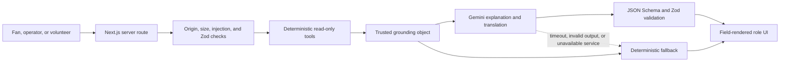

<div align="center">

# VenueIQ

### Grounded stadium intelligence for safer, smoother, and more inclusive event days

VenueIQ turns one simulated venue model into role-specific guidance for fans, operations teams,
and volunteers. Gemini explains and translates verified facts; deterministic code remains the
source of operational truth.

**Built for Google PromptWars × Hack2skill**

[Explore the product](#the-product) · [Run the showcase](#five-minute-showcase) ·
[Understand the architecture](#how-venueiq-works) · [Start locally](#run-locally) ·
[Review the evidence](#verified-quality)

</div>

> [!IMPORTANT]
> VenueIQ is a judging-ready simulation, not a live safety or emergency-response system. Venue
> conditions, routes, incidents, transport data, and impact metrics are fictional and
> deterministic so every demonstration is safe and repeatable.

## The product

Large event venues rarely have an information problem; they have a coordination problem. Fans
need a route they can trust, operators need a shared view of changing conditions, and volunteers
need the correct procedure in the guest's language.

VenueIQ connects those needs through a single stadium intelligence layer:

- Fans receive crowd-aware, step-free directions with nearby facilities and a complete text
  alternative to the map.
- Operators see scenario-driven incidents, venue pressure, transport effects, and proposed
  actions that always require human approval.
- Volunteers receive concise, localized SOP checklists with clear escalation boundaries.
- The Impact view makes operational, accessibility, and sustainability outcomes visible without
  inventing live data.

Unlike a generic chatbot, VenueIQ does not ask a language model to calculate routes, infer venue
conditions, or make operational decisions. Deterministic tools establish the facts first; the
model may only turn that trusted grounding into structured, accessible language.

## At a glance

| Role workspaces | Seeded scenarios | Supported languages | Automated checks |
| :-------------: | :--------------: | :-----------------: | :--------------: |
|      **3**      |      **8**       |        **6**        |     **195**      |

The three connected workspaces are complemented by a cross-role Impact dashboard. The eight
repeatable scenarios cover normal operations, an arrival surge, Gate C closure, train disruption,
a heat alert, medical response, an accessible-path obstruction, and waste-bin overflow. Guidance
is available in English, Spanish, French, Portuguese, Arabic, and Hindi, including RTL rendering
for Arabic.

## Connected experiences

| Experience                             | Designed for                       | Primary outcome                                                                       | Trust boundary                                                                |
| -------------------------------------- | ---------------------------------- | ------------------------------------------------------------------------------------- | ----------------------------------------------------------------------------- |
| **Fan Companion** · `/fan`             | Spectators navigating the venue    | Low-crowd, step-free routing; facilities; alerts; multilingual explanation            | The graph and constraints calculate the route; Gemini only explains it        |
| **Operations Hub** · `/operations`     | Venue control and event operations | Shared scenario picture, incident briefing, pressure indicators, and proposed actions | Every operational action remains pending until a human explicitly approves it |
| **Volunteer Assistant** · `/volunteer` | Front-line volunteers              | Grounded SOP steps in the guest's language with a named escalation path               | Responses are constrained to approved local procedures and structured fields  |
| **Impact Dashboard** · `/impact`       | Organizers and reviewers           | Transparent accessibility, mobility, safety, and sustainability indicators            | All metrics are visibly identified as simulated                               |

## Five-minute showcase

The default state is preconfigured for a clear end-to-end demonstration.

1. **Fan — accessible navigation**
   Open `/fan` and submit the prepared request:
   _“I am near Gate A. I use a wheelchair and need the safest low-crowd route to Section 214.
   Please answer in Spanish.”_
   VenueIQ returns a deterministic step-free route, crowd and distance summary, ordered
   directions, nearby accessible facilities, a schematic map, and an equivalent text route.

2. **Operations — coordinated disruption response**
   Open `/operations`, activate **Gate C closure**, and inspect the changed zones, incident,
   timeline, and briefing. Review one proposed response: it cannot be marked approved without an
   explicit human action. Return to the Fan view to see the same browser-local scenario reflected
   in public guidance.

3. **Volunteer — multilingual procedure**
   Open `/volunteer` and submit the prepared Arabic-speaking-family request. The response is a
   four-step, Arabic RTL checklist grounded in the approved accessible-entry SOP, followed by a
   clear venue-control escalation rule.

The same stories work with live Gemini responses or in deterministic demo mode, making the core
experience resilient to model, key, or network availability.

## How VenueIQ works



The model never receives authority to mutate venue state. Operations recommendations are rendered
as proposals, and the approval boundary remains in the human-controlled interface.

### Deterministic intelligence, generative communication

| Deterministic code owns                           | Gemini may add                                          |
| ------------------------------------------------- | ------------------------------------------------------- |
| Scenario state and venue conditions               | Plain-language explanation                              |
| Route graph, closures, distance, and walking time | Concise summaries for each role                         |
| Crowd, quietness, and step-free weighting         | Translation into the selected language                  |
| Facility, transport, accessibility, and SOP facts | Structured wording constrained to the supplied evidence |
| Operational calculations and fallback responses   | No new facts, actions, routes, or safety decisions      |

### Safety and privacy guardrails

- Strict request schemas, bounded JSON payloads, trusted-origin checks, and prompt-injection
  screening protect every AI route.
- Model output must satisfy a JSON schema and Zod validation. Invalid output receives one
  controlled retry before falling back to deterministic copy.
- Gemini runs server-side only; secrets never enter the browser bundle.
- Requests time out safely, public errors expose no configuration detail, and model text is never
  rendered as arbitrary HTML.
- Local development uses a bounded in-process limiter. Production live-AI routes use Upstash Redis
  and fail closed if distributed rate limiting is unavailable.
- VenueIQ has no user accounts or chat-history store and does not persist a fan's precise location
  on the server. Browser storage is limited to display preferences and the shared demo scenario.

Read the full threat model and controls in [SECURITY.md](SECURITY.md).

## Engineering highlights

- **Constraint-aware routing:** indexed, binary-heap Dijkstra routing runs in
  `O((V + E) log V)` while accounting for closures, accessibility obstructions, distance, crowd
  pressure, quietness, and step-free requirements.
- **One shared simulation:** all role pages derive their view from the same seeded stadium model,
  keeping demonstrations synchronized and repeatable.
- **Measured efficiency:** route-scoped CSS, lazy client validation, cancellable requests, warm
  server caches, and enforced production bundle budgets prevent silent regressions.
- **Maintainability gates:** production code is continuously checked against complexity 12,
  80 lines per function, 500 lines per file, strict TypeScript, and zero lint warnings.
- **Accessible by construction:** semantic landmarks, keyboard navigation, visible focus, 44 px
  targets, live regions, reduced motion, high contrast, large text, RTL content, and a complete
  ordered alternative to the SVG map.
- **Purpose-built visuals:** the stadium map and operational visualizations are local SVG/CSS,
  avoiding remote map, font, and chart dependencies.
- **Graceful degradation:** every primary flow remains usable in `AI_DEMO_MODE`, on a model
  timeout, or after schema rejection.
- **Observable behavior:** `/api/health` reports only safe status and version information, while
  each AI response identifies whether it came from Gemini or deterministic demo/fallback logic.

## Technical foundation

| Layer         | Implementation                                                                 |
| ------------- | ------------------------------------------------------------------------------ |
| Application   | Next.js 16 App Router, React 19, TypeScript 5.9                                |
| Styling       | Accessible local CSS design system and purpose-built SVG visualization         |
| Generative AI | Google Gemini through the server-only `@google/genai` SDK                      |
| Validation    | Zod 4 request and response contracts plus Gemini JSON Schema output            |
| Domain logic  | Pure TypeScript venue graph, routing, scenario, operations, and impact modules |
| Rate limiting | Upstash Redis in production; bounded process-local limiter in development      |
| Testing       | Vitest, Testing Library, Playwright, and axe-core                              |
| Delivery      | Vercel-ready build pipeline and GitHub Actions continuous integration          |

## Verified quality

The current release gate completes successfully with `npm run verify:full`:

| Gate                                      |                      Verified result |
| ----------------------------------------- | -----------------------------------: |
| Formatting, ESLint, and strict TypeScript |  Passed with zero warnings or errors |
| Unit, component, and integration tests    | **181 / 181 passed** across 24 files |
| End-to-end journeys                       |                   **10 / 10 passed** |
| Automated accessibility scans             |                     **4 / 4 passed** |
| Statement coverage                        |                           **96.47%** |
| Line coverage                             |                           **96.52%** |
| Function coverage                         |                           **96.96%** |
| Branch coverage                           |                           **89.32%** |
| Production dependency audit               |          **0 known vulnerabilities** |

The browser suite includes accessible routing, multilingual and Arabic RTL output, scenario
propagation, human approval, deterministic failure recovery, keyboard navigation, mobile reflow,
and axe scans across every primary experience.

## Run locally

### Prerequisites

- Node.js 24 or newer (the repository includes `.nvmrc`)
- npm 11 or newer
- A Gemini API key only if you want live model-generated explanations

### Setup

From the repository root:

```bash
npm install
cp .env.example .env.local
npm run dev
```

On Windows PowerShell, replace the copy command with:

```powershell
Copy-Item .env.example .env.local
```

Open [http://localhost:3000](http://localhost:3000). To run without an API key, keep
`AI_DEMO_MODE=true`; every primary flow will use deterministic grounded explanations.

### Environment variables

| Variable                   | Purpose                                                           | Required                  |
| -------------------------- | ----------------------------------------------------------------- | ------------------------- |
| `NEXT_PUBLIC_APP_URL`      | Canonical origin used for request validation and metadata         | Yes                       |
| `GEMINI_API_KEY`           | Server-only credential for live Gemini responses                  | When `AI_DEMO_MODE=false` |
| `GEMINI_MODEL`             | Gemini model identifier; currently `gemini-3.1-flash-lite`        | For live Gemini           |
| `AI_DEMO_MODE`             | Uses deterministic explanations without an external model request | Yes                       |
| `UPSTASH_REDIS_REST_URL`   | Distributed production rate-limit endpoint                        | Production live AI        |
| `UPSTASH_REDIS_REST_TOKEN` | Server-only production rate-limit credential                      | Production live AI        |

> [!CAUTION]
> Never prefix Gemini or Upstash secrets with `NEXT_PUBLIC_`, commit `.env.local`, or expose a key
> in client-side code. Restart locally or redeploy after changing environment variables.

## Verify locally

Install the browser once, then run the complete release gate:

```bash
npx playwright install chromium
npm run verify:full
npm run audit:prod
```

Individual workflows and troubleshooting guidance are documented in [TESTING.md](TESTING.md) and
[RUNBOOK.md](RUNBOOK.md).

## Deploy to Vercel

VenueIQ uses the standard Next.js deployment path. Import the repository in Vercel, retain
`npm ci` as the install command, and configure the environment variables listed above for Preview
and Production. Both Upstash variables are required when deployed live-AI routes are enabled.

Validate the production pipeline locally before deploying:

```bash
npm run vercel-build
```

For a CLI deployment:

```bash
npm install -g vercel
vercel login
vercel link
vercel
vercel --prod
```

Verify `/`, `/fan`, `/operations`, `/volunteer`, `/impact`, and `/api/health` on the Preview URL
before promoting it. The complete GitHub and CLI deployment procedures are in
[RUNBOOK.md](RUNBOOK.md#vercel-method-a-github-integration).

## Project structure

```text
src/
├── app/                # App Router pages, metadata, error states, and API routes
├── components/         # Shared UI plus fan, operations, volunteer, and impact views
└── lib/
    ├── ai/             # Schemas, grounding tools, Gemini orchestration, and fallbacks
    ├── content/        # Localized interface copy and approved volunteer SOPs
    ├── domain/         # Venue graph, simulation, routing, operations, and impact logic
    └── security/       # Request limits, origin checks, and rate limiting
tests/
├── unit/               # Pure domain and AI contract tests
├── components/         # Interaction and rendering tests
├── integration/        # API and cross-module contracts
├── e2e/                # Primary browser journeys
└── accessibility/      # Automated axe scans
```

## Documentation

| Document                             | What it covers                                                             |
| ------------------------------------ | -------------------------------------------------------------------------- |
| [ARCHITECTURE.md](ARCHITECTURE.md)   | System boundaries, data flow, domain model, and AI pipeline                |
| [RUNBOOK.md](RUNBOOK.md)             | Local setup, deployment, post-deploy checks, and troubleshooting           |
| [TESTING.md](TESTING.md)             | Test strategy, commands, coverage, and manual verification                 |
| [PERFORMANCE.md](PERFORMANCE.md)     | Reproducible route bundle measurements and enforced regression budgets     |
| [SECURITY.md](SECURITY.md)           | Threat model, data handling, headers, and production controls              |
| [ACCESSIBILITY.md](ACCESSIBILITY.md) | WCAG-oriented design decisions and assistive-technology checks             |
| [JUDGING.md](JUDGING.md)             | Evidence mapped to code quality, security, efficiency, testing, and impact |

## Current limitations

- The venue, crowd, transport, incident, and impact data are simulated rather than connected to
  real stadium systems.
- Shared scenario state is browser-local; the prototype does not provide multi-user control-room
  synchronization, authentication, or persistent incident history.
- VenueIQ supports decisions but is not an emergency-dispatch, medical, or life-safety authority.
- Live Gemini availability and supported model names depend on the configured Google AI project;
  deterministic demo mode remains the supported offline path.

## Next steps

The architecture is ready to replace seeded adapters with authorized venue, ticketing, transport,
weather, and crowd feeds; add authenticated multi-user operations; and validate recommendations
against real event-day accessibility and safety teams.

## License

Released under the [MIT License](LICENSE).
